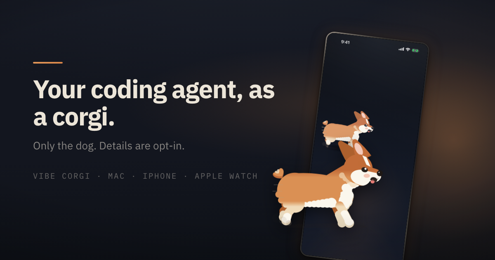
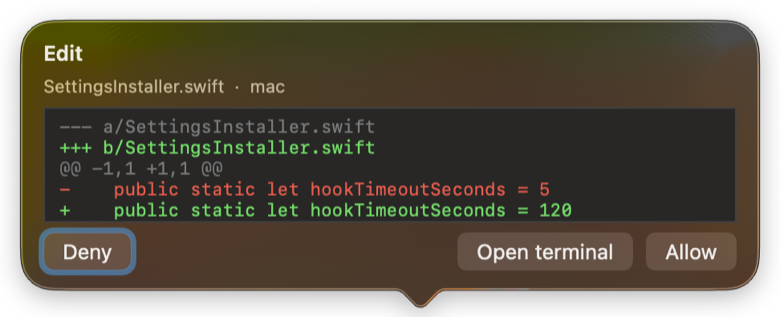

<p align="center">
  
</p>

<h1 align="center">Vibe Corgi</h1>

<p align="center">
  A corgi in your Mac menu bar that runs while Claude Code or Codex works, poops when an agent needs your approval, and rests when the session ends.
</p>

<p align="center">
  <a href="https://vibecorgi.net">vibecorgi.net</a> ·
  <a href="https://vibecorgi.net/claude-code">Claude Code</a> ·
  <a href="https://vibecorgi.net/codex">Codex</a> ·
  <a href="https://vibecorgi.net/faq">FAQ</a> ·
  <a href="https://vibecorgi.net/changelog">Changelog</a> ·
  <a href="https://vibecorgi.net/privacy">Privacy</a>
</p>

<p align="center">
  
</p>

## What the corgi is telling you

| The corgi | Your agent | Trigger (what the app actually reads) |
| --- | --- | --- |
| **Runs** flat out | Working hard | Several tool calls in flight, or more than one busy session |
| **Walks** | Normal pace | Steady tool activity |
| **Strolls** | Slowed down | Sparse activity |
| **Stands** and waits | Nothing running | No busy session; goes to a slow idle after 10 min without events |
| **Poops** | Waiting for your confirmation | `PermissionRequest` hook, or a `Notification` hook for `permission_prompt` / `agent_needs_input` / `elicitation_dialog` |
| **Lies down by an empty bowl** (hungry) | Usage quota exhausted | Status-line `rate_limits` at the limit, or a `StopFailure` with the `rate_limit` matcher |
| **Bounces** (happy) | Quota is back | The quota window reset — a short one-shot, then back to whatever it was doing |

The poop is the whole point. When an agent stops to ask, you see it from across the room instead of
finding out twenty minutes later that nothing happened. **Click the corgi** and either the approval
popover opens (diff or command, Allow / Deny) or the terminal that is waiting comes to the front.

<p align="center">
  <br/>
  <br/>
  <br/>
  
</p>

Four styles — Soft, Pixel, Ink, Geo — and 28 languages in the menu.

## Install

**Homebrew**

```sh
brew install --cask tuziani/tap/vibe-corgi
```

**DMG**

Download [VibeCorgi.dmg](https://vibecorgi.net/download/VibeCorgi.dmg) from
[vibecorgi.net](https://vibecorgi.net), open it and drag Vibe Corgi to Applications.
The app is signed with a Developer ID and notarised by Apple. macOS 13 Ventura or later.

**Uninstall**

Menu → Disconnect restores your `~/.claude/settings.json` from the backup, then
`brew uninstall --cask vibe-corgi` (or drag the app to the Trash).
`brew uninstall --zap --cask vibe-corgi` also removes `~/Library/Application Support/RunCorgi`
and the preferences file. Your `~/.claude` folder is never touched by the uninstaller.

**iPhone and Apple Watch**

The companion apps mirror the same corgi on the Lock Screen, in the Dynamic Island and on the wrist.
They are submitted to the App Store; see [vibecorgi.net](https://vibecorgi.net) for the current status.

## How it hooks into Claude Code

Click **Connect Claude Code** once. The app:

1. Copies its helper binary to `~/Library/Application Support/RunCorgi/bin/runcorgi-agent`.
2. Backs up `~/.claude/settings.json` to `~/.claude/settings.json.runcorgi.bak`
   (and a timestamped copy under `~/Library/Application Support/RunCorgi/backups/`).
3. Adds hook entries that run `runcorgi-agent hook <Event>` for
   `SessionStart`, `SessionEnd`, `UserPromptSubmit`, `PreToolUse`, `PostToolUse`,
   `PostToolUseFailure`, `Stop`, `SubagentStart`, `SubagentStop`, `PermissionRequest`,
   `StopFailure` (matcher `rate_limit`) and `Notification`
   (matchers `permission_prompt`, `agent_needs_input`, `elicitation_dialog`, `quota_auto_resume_fired`).
   Hook entries you already had are kept verbatim, in order.
4. Sets `statusLine` to `runcorgi-agent statusline` with a 5-second refresh. If you already had a
   status line, it is **wrapped**, not replaced: the helper forwards the same stdin to your command
   and relays its output, so your status line keeps drawing exactly as before.

Each hook appends one sanitised JSON line to
`~/Library/Application Support/RunCorgi/events.jsonl`; the app tails that file four times a second.
That is the entire transport — no socket, no daemon, no server.

## How it hooks into Codex

Two read-only channels, both optional (switchable in the menu):

- **CLI sessions** — tails the rollout logs Codex already writes under `~/.codex/sessions/`
  (`rollout-*.jsonl`) to see running / finished.
- **ChatGPT app hooks** — adds four entries to `~/.codex/hooks.json` (`PermissionRequest`,
  `PostToolUse`, `UserPromptSubmit`, `Stop`) so the corgi can poop when a Codex dialog is waiting
  and clear when you answer it. The helper reads exactly one field from the payload, `session_id`,
  and discards the rest. Entries from other tools in that file are preserved.

Other coding agents are covered coarsely by process activity only.

## Privacy

Discreet mode is the default: on Mac, iPhone and Watch there is only the dog — no status text, no
tool names, no numbers. Turn the details on yourself if you want them.

What the app reads from your agent: **event names, session ids, token counts and quota
percentages.** Never your code, prompts, or tool output. This is enforced by a whitelist in the hook
helper: only a fixed set of top-level keys survive, and `tool_input`, `tool_response`, `message`,
`prompt`, `transcript_path`, `content`, `messages` and friends are dropped at every nesting level
before anything is written to disk. The one exception is the approval popover, which needs to show
you the diff or command you are approving: that summary lives in a `0600` file that is deleted the
moment you answer (or on timeout) and never goes anywhere else.

What leaves your Mac:

- **Nothing to us.** There is no account, no analytics, no telemetry and no server of ours in the loop.
- **Your own iCloud** (only if you turn on *Sync to devices*): one CloudKit record in *your* private
  database with the corgi's state — gait, mood, intensity, quota percentages and reset times, and how
  many sessions each agent has. No session ids, no paths, no tool names. That is how the iPhone and
  Watch see the same dog, and it is why we cannot see it.
- **A version check**, at most once a day: a plain `GET https://vibecorgi.net/version.json` with no
  query, no body, no cookies and a bare User-Agent. It can be switched off in the menu.

Full policy: [vibecorgi.net/privacy](https://vibecorgi.net/privacy).

## Also in the menu

- **Sounds** (off by default): a short woof when it needs you, a whimper when the quota is spent, a
  happy yip when it is back. Real recordings of small dogs. One sound per thing that needs you — not
  one per state change.
- **Jump to the terminal**: Terminal, iTerm2, Ghostty, WezTerm, kitty, VS Code and Cursor
  (some via their CLI; see the [FAQ](https://vibecorgi.net/faq) for the support matrix).
- **Two agents at once**: the menu shows live session counts per agent and one quota bar per agent.
- **Mileage**: 10,000 tokens = 1 km, kept on your Mac only.

## Links

- Website: https://vibecorgi.net
- Claude Code setup: https://vibecorgi.net/claude-code
- Codex setup: https://vibecorgi.net/codex
- FAQ: https://vibecorgi.net/faq
- Changelog: https://vibecorgi.net/changelog (mirrored in [CHANGELOG.md](CHANGELOG.md))
- Homebrew tap: https://github.com/tuziani/homebrew-tap
- Feedback: conyleeyn@daum.net · X [@conylableeyn](https://x.com/conylableeyn) · Threads [@conyleeyn](https://www.threads.net/@conyleeyn)

Vibe Corgi is an independent app and is not affiliated with, endorsed by or sponsored by Anthropic
or OpenAI. Those names appear only to state compatibility.

Vibe Corgi and the corgi character are © 2026 ConyLab. All rights reserved. This repository holds
the README, release notes and screenshots; the application source is not published.
